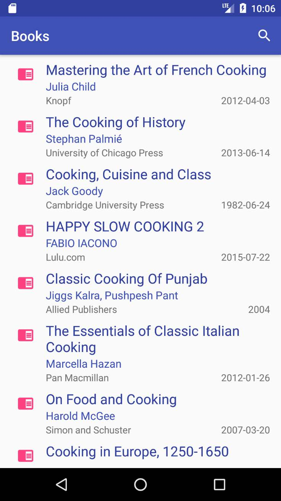
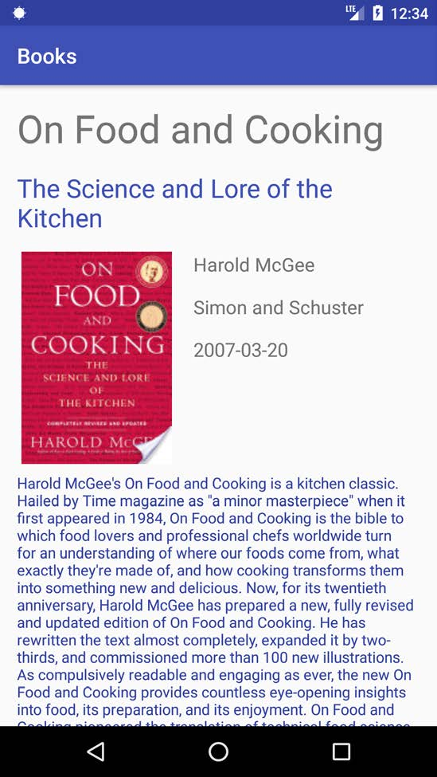

# Books Library Application

Welcome to the Books Library Mobile Application! With this app, you can easily search and discover books from the vast collection available on Google Books. Whether you're looking for bestsellers, classic literature, or educational books, this app has got you covered.

# Features

<ul>
<li>Implementing <a href="https://developers.google.com/books">Google Books API </a> </li>
<li>Search for books by title, author, ISBN, or keyword</li>
<li>View book details such as description, publisher, and publication date</li>
</ul>

# Installation

The Google Books Mobile Application is available Only for Android 9 and Above.

# Getting Started

<ul>
Launch the app
<li>Use the search bar at the top of the screen to find books by title</li>
<li>Use the advanced search at the menu to find books by title, author, ISBN, or keyword.</li>
</ul>

# To Be Added

<ul>
<li>Refactor and use Retroift</li>
<li>Refactor and use Room DB</li>
<li>Read book previews and reviews</li>
<li>Add books to your personal library</li>
<li>Create custom book lists and share with others</li>
<li>Tap on a book to view its details, including a book preview and reviews.</li>
<li>To add a book to your library, tap the "Add to Library" button.</li>
<li>To create a custom book list, tap the "Lists" button and thentap the "Create List" button.</li>
</ul>

# Support

If you experience any issues with the Books Library Mobile Application, please Open an Issue .

# Conclusion

I hope you enjoy using the Books Library Mobile Application. With its vast collection of books and user-friendly interface, it's the perfect tool for book lovers and avid readers alike. Happy reading!

